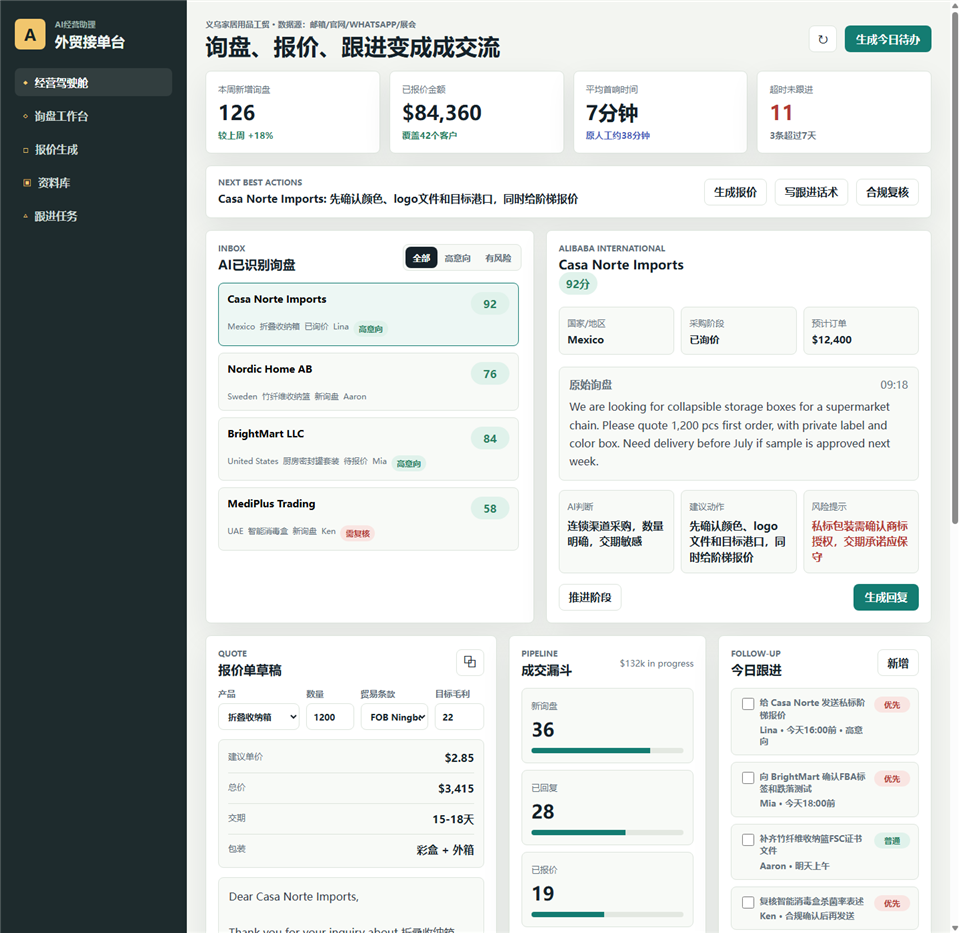
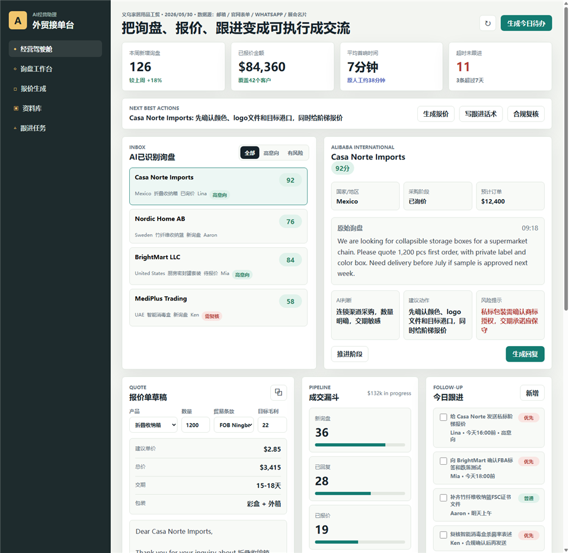
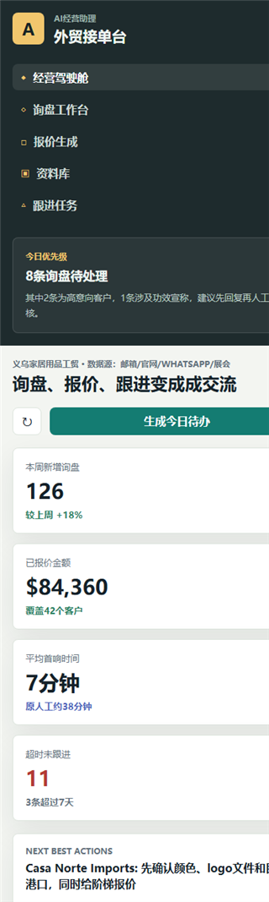

# BizPilot AI SME Assistant

An AI business copilot prototype for small and medium-sized companies: inquiry triage, quotation drafting, sales follow-up, knowledge-base readiness, and compliance review.

[Live Demo](https://zhihaohu1996.github.io/bizpilot-ai-sme-assistant/) · [Repository](https://github.com/Zhihaohu1996/bizpilot-ai-sme-assistant)

  

## Overview

BizPilot AI SME Assistant is built for teams that receive leads from many channels but struggle to turn them into a repeatable sales workflow.

The prototype combines inbox-style inquiry handling, AI intent detection, quotation drafting, product knowledge readiness, follow-up tasks, and compliance warnings. It is especially relevant for export-oriented SMEs that work across email, website forms, WhatsApp, trade shows, and product catalogs.

## Key Features

- Business dashboard for new inquiries, quote value, response speed, and follow-up risk
- Inquiry workspace with customer context, source channel, intent, and next action
- AI-assisted quotation draft with MOQ, margin, trade terms, and English reply text
- Knowledge-base readiness checks for product sheets, packaging data, certificates, and historical emails
- Follow-up task list for sales owners and urgent opportunities
- Compliance warning flow for sensitive product claims

## Screenshots

  
   
  
   
  

## Who It Is For

- Small and medium-sized export businesses
- Sales teams handling multi-channel inquiries
- Founders evaluating practical AI copilots for operations
- Product builders studying AI workflow tools for non-technical business users

## Project Status

This is a high-fidelity static prototype for business workflow validation, demo conversations, and portfolio presentation.

## Roadmap Ideas

- Add real inbox imports from email, forms, and WhatsApp exports
- Add a product knowledge-base editor and quote template manager
- Add CRM-style customer history and task ownership
- Add compliance review status for product claims and certificates
- Add exportable quote sheets and email drafts

## Team And Contributions

- Zhihao Hu: project owner, product vision, SME scenario research, export-business workflow design, feature prioritization, market positioning, and final project direction
- DanXian: collaborator, business scenario discussion, product feedback, and workflow refinement
- Codex: AI-assisted implementation support, static frontend assembly, README formatting, and screenshot preparation

## License

MIT License. See [LICENSE](./LICENSE).
