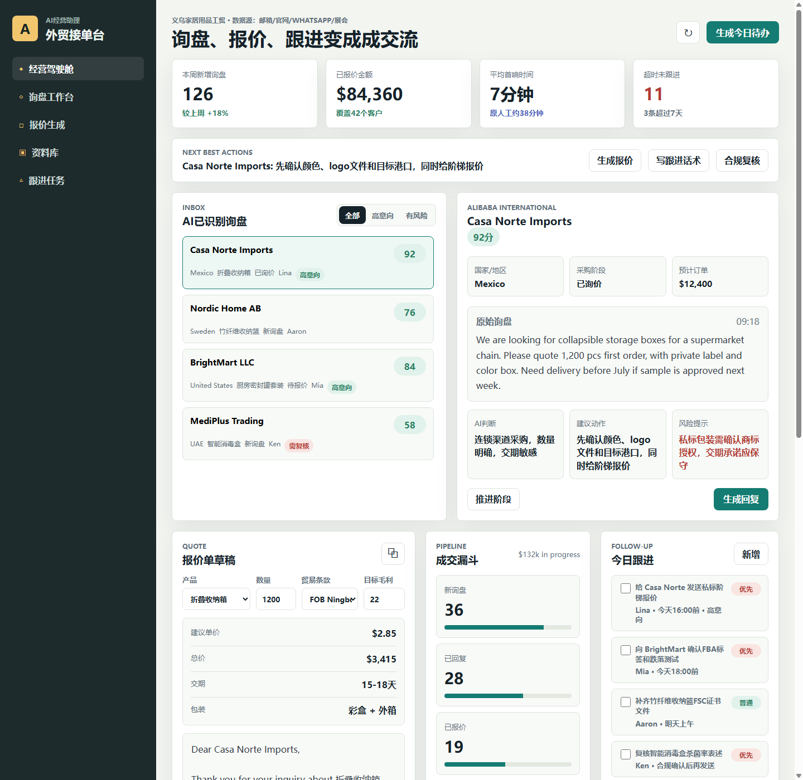

# BizPilot AI SME Assistant

中小企业 AI 助理方案 App 原型：外贸接单台。

## Why It Matters

中小企业的增长瓶颈常常不是“没有线索”，而是询盘分散、报价慢、资料不齐、合规表达没人复核、跟进任务丢失。这个原型把邮箱、官网表单、WhatsApp 和展会线索整理成一个 AI 经营助理工作台，帮助业务团队把询盘、报价和跟进变成连续成交流。

## Highlights

- 经营驾驶舱：高意向询盘、机会金额、响应速度和跟进风险
- 询盘工作台：客户画像、AI 意图识别、风险提示和下一步建议
- 报价生成：MOQ、毛利、贸易条款和英文报价回复草稿
- 资料库健康度：报价表、包装资料、认证报告和历史邮件样本
- 跟进任务：自动生成待办，提醒人工复核敏感宣传表述

## Demo

Open `index.html` in a browser, or publish this repository with GitHub Pages.

## Project Team

This project was co-created by DanXian and Codex.

制作人员：

- DanXian: product direction, business scenario design, and collaboration
- Codex: AI-assisted prototyping, frontend implementation, and README preparation

## Suggested Topics

`sme`, `ai-assistant`, `business-copilot`, `sales-automation`, `export-business`, `prototype`, `github-pages`

